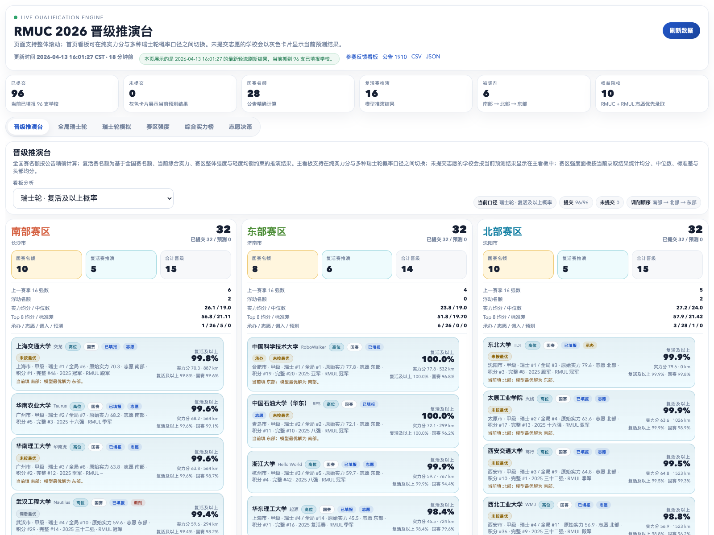
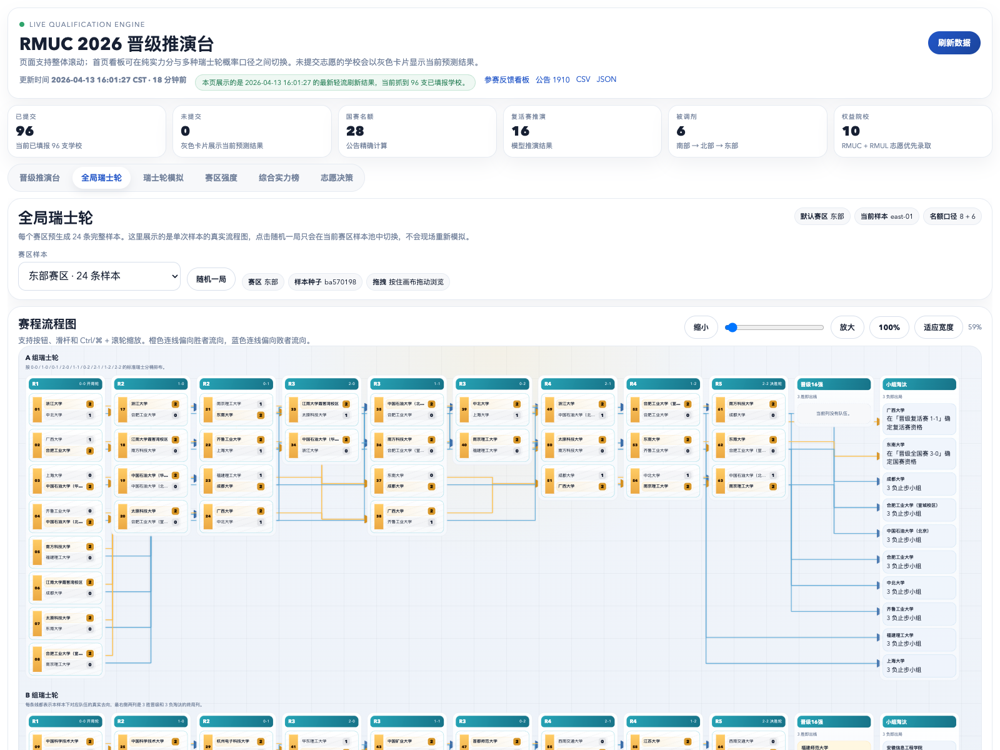
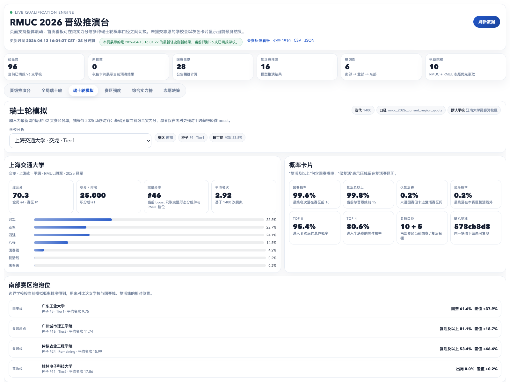
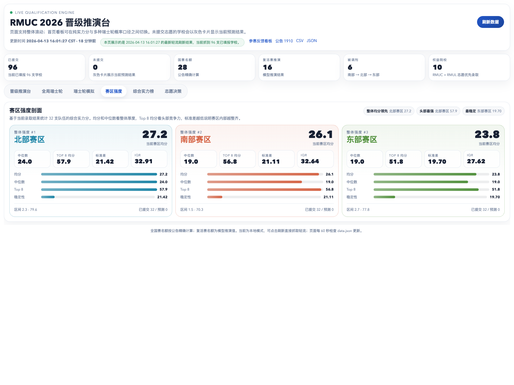
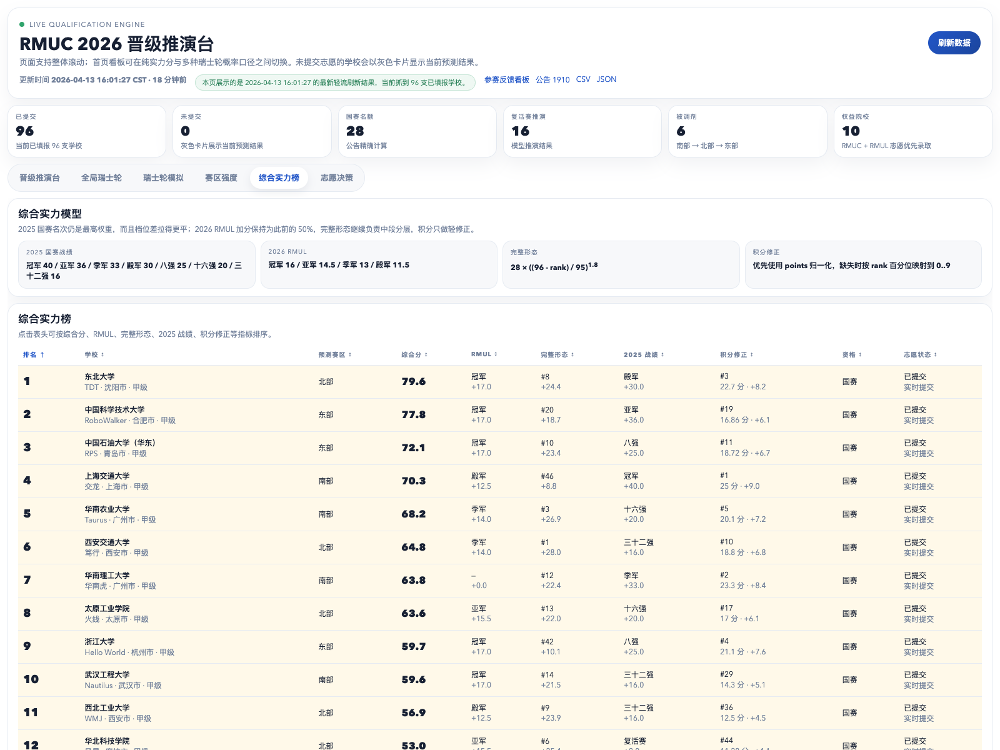
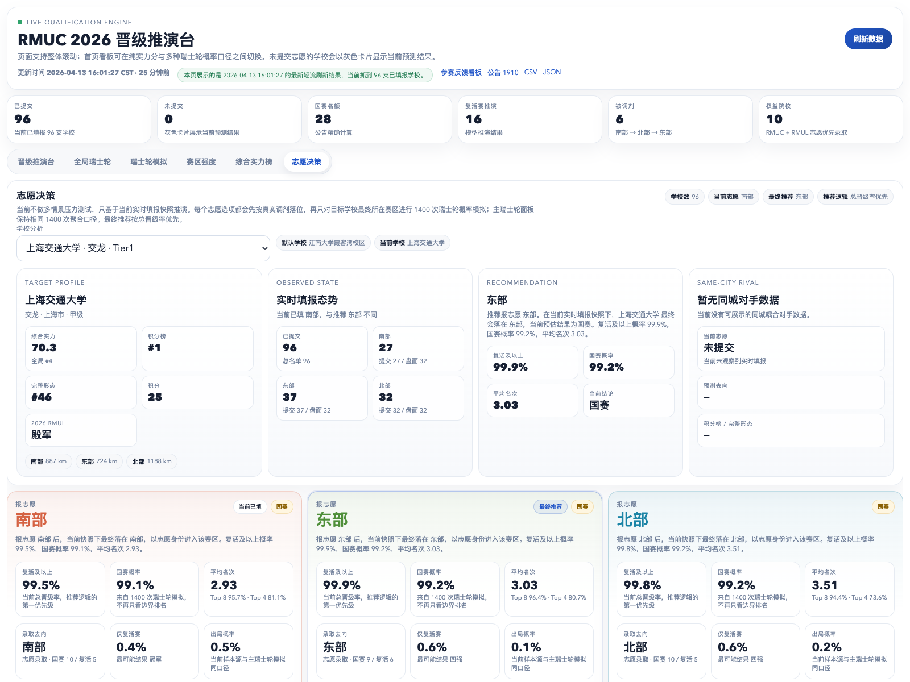

> 免责声明
>
> 本项目是SHARK战队编写的区域赛志愿填报辅助工具，非官方社区开源工具，与 DJI / RoboMaster 官方无关。
>
> 项目中的调剂结果、**实力分**、瑞士轮样本、志愿建议和晋级概率都只用于技术讨论与模型复现，战队实力预测仅供娱乐参考，不代表官方或SHARK战队观点，也不构成正式填报建议。
>
> 本项目对所有战队的实力分预测仅供娱乐参考，项目自身持中立态度，所有战队通用一份公式，具体规则参考下文。
>
> 所有录取、晋级、赛程和名额结果请以 RoboMaster 官方公告与最终发布为准。

# RMUC 2026 Registration Dashboard

**~~赛博RM斗蛐蛐~~     基于赛区志愿选择的RMUC 2026 区域赛名单分析看板**

## 项目简介

RMUC 2026 Registration Dashboard 面向 RMUC 2026 志愿填报阶段，提供一套基于公开规则、公开战绩、积分信息、志愿快照和赛制路径构建的分析与可视化实现。

文档、脚本和前端页面围绕同一套数据流组织，覆盖志愿抓取、赛区调剂、综合实力分、晋级名额推演、瑞士轮模拟和看板展示。

项目关注的核心问题包括：

- 当前志愿盘面下，三个赛区会如何调剂
- 当前赛区分布下，国赛线和复活线大致落在哪里
- 如果按 2025 瑞士轮赛制去近似 2026 的赛区对抗，晋级概率会是什么样
- 一套公开可复现的模型，如何从输入数据一路生成可视化看板

## 页面功能

看板前端由一个主页面承载，内部包含多个分析子页面。各子页面的职责如下。

### 1. 晋级推演台

主页面默认展示当前三个赛区的完整盘面，用于查看：

- 当前志愿分布与调剂结果
- 各赛区国赛名额、复活赛名额和边界队伍
- 已提交学校与预测学校的当前落点
- 在不同分析口径下的赛区内部排序

这一页适合做整体盘面判断，优先回答“当前赛区分布会导向什么结果”。



### 2. 全局瑞士轮

该页面提供按赛区预生成的完整样本池，用于展示一条可复现的比赛路径，包括：

- 分组与种子位置
- 瑞士轮每轮配对
- 淘汰赛与资格赛路径
- 单次样本下的最终名次与资格结果

这一页适合做“样本路径”层面的观察，关注的是某一条具体赛程如何展开。



### 3. 瑞士轮模拟

该页面面向单支学校，展示在当前赛区快照下经过大量 Monte Carlo 模拟后的统计结果，包括：

- 国赛概率
- 复活及以上概率
- 仅复活概率
- 出局概率
- Top 8 / Top 4 概率
- 平均名次与赛区泡泡位对比

这一页适合做“单校概率分析”，关注的是某支学校在当前赛制口径下的总体机会分布。



### 4. 赛区强度

该页面按赛区统计整体强度特征，主要指标包括：

- 赛区均分
- 中位数
- Top 8 均分
- 标准差
- IQR 与分数区间

这一页适合做赛区间横向比较，关注的是赛区整体厚度、头部竞争力和离散程度。



### 5. 综合实力榜

该页面按综合实力分对全部学校进行排序，并展开各组成项，用于查看：

- 全局实力排序
- 赛区内实力排序
- RMUL 加分、完整形态分、历史战绩分、积分分的构成
- 当前资格状态与赛区归属

这一页适合做模型输入与排序依据的核对，也是理解后续概率输出的基础页面。



### 6. 志愿决策

该页面面向单支学校，对三种志愿填报方案分别做当前快照下的结果评估，展示：

- 不同志愿下的最终落区
- 赛区内排位变化
- 国赛 / 复活相关概率变化
- 推荐志愿及其依据

这一页适合做方案比较，关注的是“在当前盘面下更换志愿后会带来怎样的结果变化”。



## 快速开始

建议使用 Python 3.11 或更高版本。

```bash
git clone <your-repo-url>
cd RMUC2026-Registration-Dashboard

# 可选：部分环境下抓取 Qingflow 更稳
python3 -m pip install certifi

# 构建数据
python3 scripts/build_dashboard.py

# 启动本地看板
python3 scripts/start_dashboard.py

# 关闭本地看板
python3 scripts/start_dashboard.py --stop
```

如果不想触发线上刷新，只想看当前已经生成的 `docs/`：

```bash
python3 scripts/start_dashboard.py --skip-initial-refresh
```

如果本地服务已经启动，也可以单独执行以下命令关闭：

```bash
python3 scripts/start_dashboard.py --stop
```

## 项目结构

- [`allocator.py`](./allocator.py)：按公告规则实现志愿录取与调剂
- [`qualification.py`](./qualification.py)：完整 roster、综合实力分、赛区强度与晋级名额模型
- [`swiss_simulation.py`](./swiss_simulation.py)：瑞士轮与淘汰赛 Monte Carlo 模拟
- [`qingflow.py`](./qingflow.py)：轻流分享看板抓取器
- [`scripts/build_dashboard.py`](./scripts/build_dashboard.py)：构建 `docs/` 所需数据
- [`scripts/serve_dashboard.py`](./scripts/serve_dashboard.py)：本地服务与刷新接口
- [`scripts/start_dashboard.py`](./scripts/start_dashboard.py)：一键启动本地看板
- [`docs/index.html`](./docs/index.html)：前端页面
- [`data.csv`](./data.csv)：本地志愿缓存；轻流不可用时作为回退输入
- [`tests/`](./tests)：规则与页面行为测试

## 整体计算架构

整个看板的数据流是：

```text
Qingflow / 本地 data.csv
        ↓
qualification.build_projected_teams
        ↓
allocator.allocate
        ↓
qualification.compute_strength_table
        ↓
qualification.assign_qualifications
        ↓
swiss_simulation.build_swiss_simulation
        ↓
scripts/build_dashboard.py
        ↓
docs/data.json / docs/data.csv / docs/volunteer_decision.json / docs/global_swiss_samples.json
        ↓
docs/index.html
```

按层拆开看：

1. 输入层优先从轻流抓取实时志愿；如果轻流接口不可用，则回退到仓库根目录的 `data.csv`
2. 补全层对没有实时志愿的学校，用“承办默认赛区”或“地理最近赛区”补成完整 96 队快照
3. 调剂层按公告规则完成三个赛区的志愿录取与调剂
4. 评分层为每支队伍计算综合实力分，并统计赛区整体强度
5. 名额层先按公告精确算出国赛名额，再按模型选出复活赛名额
6. 模拟层基于当前赛区名单和赛制路径，做瑞士轮与淘汰赛 Monte Carlo 模拟
7. 展示层
   把结果打平成前端需要的 JSON / CSV，再由静态页面渲染

## 综合实力分计算公式

综合实力分在 [`qualification.py`](./qualification.py) 中定义，当前实现是固定权重模型：

$$
S = B_{\text{rmul}} + F_{\text{form}} + H_{\text{history}} + P_{\text{points}}
$$

其中：

- $B_{\text{rmul}}$：RMUL 档位奖励
- $F_{\text{form}}$：完整形态分
- $H_{\text{history}}$：历史战绩分
- $P_{\text{points}}$：积分项

### 1. RMUL 奖励项

设 RMUL 档位类别为 $c$，则 $B_{\text{rmul}} = f_{\text{rmul}}(c)$，具体映射如下：

| RMUL 档位 | 分值 |
| --- | ---: |
| `champion` | 17.0 |
| `runner_up` | 15.5 |
| `third_place` | 14.0 |
| `fourth_place` | 12.5 |
| 其他 | 0 |

### 2. 完整形态分

设完整形态排名为 $r_{\text{form}}$，则：

$$
x = \max\left(0,\frac{96-r_{\text{form}}}{95}\right)
$$

$$
F_{\text{form}} = 28 \cdot x^{1.8}
$$

这意味着前排学校的区分度更高，中后段衰减更快；如果没有完整形态排名，这一项记为 $0$。

### 3. 历史战绩项

设历史成绩类别为 $h$，则 $H_{\text{history}} = f_{\text{history}}(h)$，具体映射如下：

| 历史战绩 | 分值 |
| --- | ---: |
| `champion` | 40 |
| `runner_up` | 36 |
| `third_place` | 33 |
| `fourth_place` | 30 |
| `quarter_finalist` | 25 |
| `top_16` | 20 |
| `top_32` | 16 |
| `revival` | 8 |
| 其他 | 0 |

### 4. 积分项

如果有原始积分 $p$，且全表最高积分为 $p_{\max}$，则：

$$
P_{\text{points}} = 9 \cdot \frac{p}{p_{\max}}
$$

如果没有原始积分、但有积分榜排名 $r_{\text{points}}$，则退化为按排名线性归一化：

$$
P_{\text{points}} =
9 \cdot
\frac{r_{\max} - r_{\text{points}}}{r_{\max} - r_{\min}}
$$

### 5. 最终排序

综合实力分算完后，排序键为：

$$
S \downarrow
\;\rightarrow\;
r_{\text{form}} \uparrow
\;\rightarrow\;
r_{\text{points}} \uparrow
\;\rightarrow\;
\text{school name} \uparrow
$$

也就是先看总分，再看完整形态，再看积分排名，最后用学校名稳定排序。

## 国赛名额与复活赛名额

### 国赛名额

国赛名额按公告规则精确计算。

- 每个赛区基础 8 个国赛名额
- 统计当前赛区中上一赛季 `top16` 队伍数量
- 只有 `top16_count > 4` 的赛区参与 4 个浮动名额分配
- 浮动名额按比例分配，余数用最大余数法处理

计算结果为：

$$
N_{\text{national}}(r) = 8 + N_{\text{floating}}(r)
$$

### 复活赛名额

复活赛名额采用模型推演。

当前实现先计算赛区强度上下文：

- 赛区均分
- 赛区中位数
- 赛区 Top 8 均分
- 赛区标准差

随后对这些指标做中心化处理并加权，得到赛区 bonus，再与队伍综合实力、赛区均衡约束、饱和惩罚共同形成复活赛候选分。抽象写法如下：

$$
R_i =
S_i + B_{\text{region}} + B_{\text{balance}} - P_{\text{saturation}}
$$

该步骤的目标是使复活赛分布同时反映：

- 当前赛区强度差异
- 各赛区晋级人数的基本均衡
- 单赛区不要被过度塞满

## 为什么要用瑞士轮来计算晋级概率

单独使用综合实力榜，只能提供静态强弱关系，无法充分描述赛制路径下的晋级机会。

因为晋级结果不只由静态强弱决定，还受到这些因素影响：

- 分组与抽签位置
- 瑞士轮的同战绩配对机制
- 强队是否会提前互撞
- 复活线、国赛线对应的实际名次区间
- BO3 波动和淘汰赛路径

在 RMUC 这一类赛制中，国赛和复活资格的取得取决于完整的对阵路径。
因此，瑞士轮模拟用于将路径依赖、对手强度和随机波动一并纳入概率估计。

## 瑞士轮计算原理

瑞士轮模拟在 [`swiss_simulation.py`](./swiss_simulation.py) 中实现，核心流程是：

1. 先按当前赛区名单做种子排序
2. 按 2025 赛制布局完成分组和首轮配对
3. 瑞士轮阶段按同战绩继续配对
4. 每场 BO3 根据双方有效差值抽样
5. 打完整个瑞士轮与后续淘汰赛
6. 记录最终名次是否落入国赛线或复活线
7. 重复很多次，统计概率

### 单场胜率

设双方有效差值为 $\Delta_{\text{eff}}$，则单局胜率模型为：

$$
P(\text{left wins}) =
\frac{1}{1+\exp\left(-\frac{\Delta_{\text{eff}}}{\tau}\right)}
$$

其中当前实现里 $\tau = \text{LOGISTIC\_SCALE}$。

$\Delta_{\text{eff}}$ 表示加入弱者轻微 boost 后的裁剪差值：

$$
\Delta_{\text{eff}} =
\mathrm{clip}\left(S'_L - S'_R,\,-\Delta_{\max},\,\Delta_{\max}\right)
$$

boost 主要来自：

- 完整形态分组件
- RMUL 档位加成

而且只在弱队面对强队时生效，不会无条件抬高所有队伍。

### BO3 抽样

BO3 采用基于单局胜率的结果抽样，先推导出：

- $2{:}0$
- $2{:}1$
- $0{:}2$
- $1{:}2$

四种结果的概率区间，再据此抽样确定该 series 的最终结果。

### 概率输出

假设总共模拟 $N$ 次，则：

$$
\hat p_{\text{national}} = \frac{N_{\text{national}}}{N}
$$

$$
\hat p_{\text{revival}} = \frac{N_{\text{revival or better}}}{N}
$$

$$
\hat p_{\text{out}} = \frac{N_{\text{out}}}{N}
$$

最终输出的是赛制口径下的经验概率，而非解析闭式解。

## 逐队实力分的解释边界

模型输出并不等同于可直接发布的公开排行榜。

原因主要有几点：

- 实力分是模型内部变量，不对应官方实力榜
- 模型会混合公开战绩、积分、完整形态排名、历史档位和若干工程假设，天然带有建模偏差
- 对外直接贴出逐队强弱，很容易被误读成“官方排序”或“确定性结论”
- 志愿填报阶段本身高度敏感，逐队标签化输出容易放大不必要的舆论和策略噪声

更准确的定位是：

- 一套公开可复现的工程实现
- 一套可审阅、可讨论的建模方法
- 一套面向赛区结构、赛制路径和整体分布的分析工具

## 常用命令

```bash
# 单独查看轻流抓取结果
python3 qingflow.py https://qingflow.com/appView/e3bol1op1c02/shareView/e3bol20d1c02

# 单独跑一次志愿调剂
python3 allocator.py \
  --url https://qingflow.com/appView/e3bol1op1c02/shareView/e3bol20d1c02 \
  --output result.csv

# 关闭本地服务
python3 scripts/start_dashboard.py --stop

# 运行测试
python3 -m unittest discover -s tests
```

## 数据来源

- `distances.csv`：根据官方公告附表整理的距离数据
- `robomaster_2026_teams.csv`：完整 96 队基础 roster
- `ranks.csv`：积分榜与积分补全数据
- `data.csv`：本地最终志愿缓存
- Qingflow 分享看板：实时志愿来源

## 自动构建与发布

项目包含 [`.github/workflows/update.yml`](./.github/workflows/update.yml)：

- push 到 `main` 后自动构建
- 定时刷新 `docs/data.json` 等产物
- 可以直接部署到 GitHub Pages

## 贡献

欢迎通过 Issue 或 PR 一起校规则、补数据、修正文案和改进前端展示。
